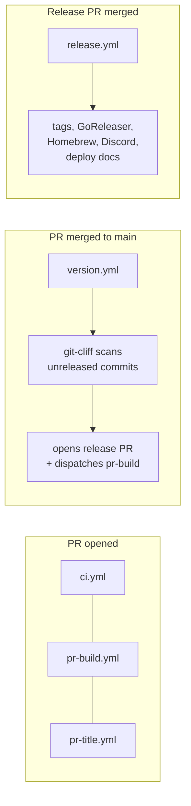

# CI/CD Workflows

## How releases work



### 1. PR phase

Three workflows run when a PR targets `main`:

| Workflow | Trigger | Purpose |
|----------|---------|---------|
| `ci.yml` | `pull_request` | Lint, build, test (JS + Go + release scripts) |
| `pr-build.yml` | `pull_request` | Snapshot build via GoReleaser, upload artifacts, post install comment |
| `pr-title.yml` | `pull_request_target` | Validate PR title matches [conventional commits](https://www.conventionalcommits.org/) |

Commit prefixes determine release behavior:
- `feat: ...` → minor version bump, **Features** section
- `fix: ...` → patch version bump, **Fixes** section
- `perf: ...` → patch version bump, **Features** section
- `security: ...` → patch version bump, **Security** section (shown at the top, right after Breaking)
- `feat!: ...` / `fix!: ...` / `security!: ...` / `BREAKING CHANGE:` footer → major version bump, **Breaking** section
- `docs: ...` → **Docs** section, no bump on its own (appears in the next release if one is triggered)
- Everything else (`ci:`, `refactor:`, `chore:`, `test:`, `style:`, `build:`, `revert:`) → skipped entirely

Scopes are optional but encouraged for monorepo areas. Use `feat(peering): ...`, `fix(web): ...`, `docs(cli): ...`, etc. The scope appears as a bold tag in the changelog bullet: `- **(peering)** reconnect after system sleep`. Unscoped commits render without the tag.

Because we use **rebase merge** (not squash merge), every atomic commit on a feature branch lands on `main` as-is. Each commit must follow conventional commits because they all become changelog material.

### 2. Version phase (push to main)

`version.yml` runs on every push to `main`, or manually via `workflow_dispatch`:

1. `version.sh` exits early if HEAD is a release commit (loop prevention).
2. [git-cliff](https://git-cliff.org/) scans commits between the last `v*` tag and `HEAD`, grouping them by conventional commit type via `cliff.toml`.
3. If any commit is a `feat`, `fix`, `security`, or breaking change, the script computes the next version (semver bump from the highest-impact commit). Version headings include an ISO date: `## v1.2.0 - 2026-04-10`.
4. Optional prose from `RELEASE_HIGHLIGHTS.md` is prepended to the changelog section. Leave the file empty for releases that don't need a prose summary.
5. `changelog.mdx` and `RELEASE_NOTES.md` are updated, and `RELEASE_HIGHLIGHTS.md` is reset to its stub content for the next cycle.
6. A `release/next` PR is opened (or updated) via `peter-evans/create-pull-request`.
7. `pr-build.yml` is dispatched via `workflow_dispatch` to build artifacts for the release PR (commits from `GITHUB_TOKEN` don't fire `pull_request` events, so this has to be manual).

To edit highlights for an upcoming release: push a new commit to `main` that modifies `RELEASE_HIGHLIGHTS.md`. The next `version.yml` run picks it up. You can also edit the release PR's branch directly if a release is already queued; the content just needs to make it to `main` before the release PR merges.

### 3. Release phase (release PR merged)

`release.yml` triggers when the `release/next` PR is merged (or on manual tag push):

1. Extracts version from PR title (`release: v1.2.0`).
2. Creates and pushes the git tag.
3. Runs GoReleaser (binaries + GitHub Release + Homebrew tap).
4. Sends a Discord notification using the highlights prose from `RELEASE_NOTES.md`.
5. Deploys the docs site (via `pages.yml`).

## Security model

### Permissions

Workflows set `permissions: {}` at the top level (deny-all), then grant minimum required permissions per job. `ci.yml` is the exception: it uses workflow-level `permissions: contents: read` since both jobs need the same access.

| Workflow | Job | Permissions |
|----------|-----|-------------|
| `ci.yml` | `js`, `go` | `contents: read` |
| `pr-title.yml` | `lint` | `pull-requests: read` |
| `pr-build.yml` | `build` | `contents: read`, `pull-requests: write` |
| `version.yml` | `version` | `contents: write`, `pull-requests: write`, `actions: write` |
| `release.yml` | `release` | `contents: write` |
| `release.yml` | `deploy-docs` | `contents: read`, `pages: write`, `id-token: write` |
| `pages.yml` | `build` | `contents: read` |
| `pages.yml` | `deploy` | `pages: write`, `id-token: write` |

### Action pinning

All third-party actions are pinned to full commit SHAs to prevent supply-chain attacks. The version tag is kept as a comment for readability:

```yaml
- uses: actions/checkout@de0fac2e4500dabe0009e67214ff5f5447ce83dd # v6
```

### Fork PR safety

- `pull_request` triggers: run fork code but with a **read-only** `GITHUB_TOKEN` and **no access to secrets**. The comment step in `pr-build.yml` will fail silently for fork PRs.
- `pull_request_target` (`pr-title.yml`): runs **base branch code**, never checks out or executes fork code. Only reads the PR title via the API.
- No workflow uses `pull_request_target` + `actions/checkout` with the PR ref (the known anti-pattern for secret exfiltration).

### Environments

The `release` job uses the `release` environment. Sensitive secrets (`HOMEBREW_TAP_TOKEN`, `DISCORD_WEBHOOK_URL`) should be configured as environment secrets there, not as repo-level secrets. This scopes them to only the release job and allows deployment branch restrictions.

### Loop prevention

Two mechanisms prevent infinite workflow loops:

1. `version.sh` checks if HEAD is a release commit (`release: vX.Y.Z` or `Merge ... release/next`) and exits early.
2. GitHub's built-in rule: events from `GITHUB_TOKEN` don't trigger other workflows (so the release PR creation doesn't fire `pull_request`, and the tag push doesn't re-fire `push: tags`).

### Merge strategy

The repo uses **rebase merge** for feature PRs (Settings → General → Pull Requests). This preserves atomic commit history on `main` so git-cliff can read each commit individually. Squash merge would collapse a PR into a single commit and lose the structured history.

The release PR (`release/next`) is an exception: it's merged as a single commit (`release: vX.Y.Z`) so the release is identifiable in `git log --first-parent`.

## Repo settings

These settings should be configured in the GitHub repository:

1. **Settings → Actions → General → Workflow permissions**: select **"Read repository contents and packages permissions"** (least-privilege default for all workflows).
2. **Settings → Environments**: create a `release` environment with deployment branches restricted to `main`. Move `HOMEBREW_TAP_TOKEN` and `DISCORD_WEBHOOK_URL` there.

## Scripts

Workflow scripts live in `.github/workflows/scripts/`, colocated with the workflows that use them:

| Script | Used by | Purpose |
|--------|---------|---------|
| `version.sh` | `version.yml` | Compute next version via git-cliff, update changelog, inject highlights, prepare release PR |
| `version_test.sh` | `ci.yml`, manual | End-to-end tests for `version.sh` using scratch git repos |
| `notify-discord.sh` | `release.yml` | Send release notification to Discord webhook (reads highlights from `RELEASE_NOTES.md`) |
