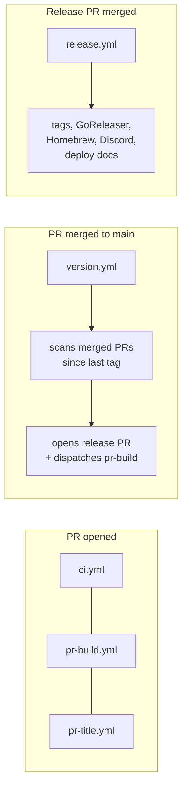

# CI/CD Workflows

## How releases work



### 1. PR phase

Three workflows run when a PR targets `main`:

| Workflow | Trigger | Purpose |
|----------|---------|---------|
| `ci.yml` | `pull_request` | Lint, build, test (JS + Go) |
| `pr-build.yml` | `pull_request` | Snapshot build via GoReleaser, upload artifacts, post install comment |
| `pr-title.yml` | `pull_request_target` | Validate PR title matches [conventional commits](https://www.conventionalcommits.org/) |

PR titles determine release behavior:
- `feat: ...` → minor version bump
- `fix: ...` → patch version bump
- `feat!: ...` / `fix!: ...` → major version bump (breaking)
- Everything else (`docs:`, `ci:`, `refactor:`, `chore:`, etc.) → no release

### 2. Version phase (push to main)

`version.yml` runs on every push to `main`, or manually via `workflow_dispatch`:

1. Exits early if HEAD is a release commit (loop prevention).
2. Runs `version.sh` which scans `git log` for merged PRs since the last `v*` tag.
3. For each PR, fetches the title via `gh pr view` and classifies by conventional commit prefix.
4. If there are releasable PRs (`feat:` or `fix:`), computes the next version, generates an LLM summary via `summarize.sh`, updates `changelog.mdx` and `RELEASE_NOTES.md`.
5. Opens (or updates) a `release/next` PR via `peter-evans/create-pull-request`.
6. Dispatches `pr-build.yml` via `workflow_dispatch` to build artifacts for the release PR (needed because commits from `GITHUB_TOKEN` don't trigger `pull_request` events).

Since `version.sh` is idempotent, you can re-run the workflow manually (Actions → Version → Run workflow) to regenerate the release PR, for example if the LLM summary failed.

### 3. Release phase (release PR merged)

`release.yml` triggers when the `release/next` PR is merged (or on manual tag push):

1. Extracts version from PR title (`release: v1.2.0`).
2. Creates and pushes the git tag.
3. Runs GoReleaser (binaries + GitHub Release + Homebrew tap).
4. Sends a Discord notification with an LLM-condensed summary.
5. Deploys the docs site (via `pages.yml`).

## Security model

### Permissions

Workflows set `permissions: {}` at the top level (deny-all), then grant minimum required permissions per job. `ci.yml` is the exception: it uses workflow-level `permissions: contents: read` since both jobs need the same access.

| Workflow | Job | Permissions |
|----------|-----|-------------|
| `ci.yml` | `js`, `go` | `contents: read` |
| `pr-title.yml` | `lint` | `pull-requests: read` |
| `pr-build.yml` | `build` | `contents: read`, `pull-requests: write` |
| `version.yml` | `version` | `contents: write`, `pull-requests: write`, `actions: write` |
| `release.yml` | `release` | `contents: write` |
| `release.yml` | `deploy-docs` | `contents: read`, `pages: write`, `id-token: write` |
| `pages.yml` | `build` | `contents: read` |
| `pages.yml` | `deploy` | `pages: write`, `id-token: write` |

### Action pinning

All third-party actions are pinned to full commit SHAs to prevent supply-chain attacks. The version tag is kept as a comment for readability:

```yaml
- uses: actions/checkout@de0fac2e4500dabe0009e67214ff5f5447ce83dd # v6
```

### Fork PR safety

- `pull_request` triggers: run fork code but with a **read-only** `GITHUB_TOKEN` and **no access to secrets**. The comment step in `pr-build.yml` will fail silently for fork PRs.
- `pull_request_target` (`pr-title.yml`): runs **base branch code**, never checks out or executes fork code. Only reads the PR title via the API.
- No workflow uses `pull_request_target` + `actions/checkout` with the PR ref (the known anti-pattern for secret exfiltration).

### Environments

The `release` job uses the `release` environment. Sensitive secrets (`HOMEBREW_TAP_TOKEN`, `DISCORD_WEBHOOK_URL`) should be configured as environment secrets there, not as repo-level secrets. This scopes them to only the release job and allows deployment branch restrictions.

`OPENROUTER_API_KEY` is needed by both `version.yml` (repo-level, runs on main push) and `release.yml` (in the `release` environment), so it lives in both places.

### Loop prevention

Two mechanisms prevent infinite workflow loops:

1. `version.sh` checks if HEAD is a release commit (`release: vX.Y.Z` or `Merge ... release/next`) and exits early.
2. GitHub's built-in rule: events from `GITHUB_TOKEN` don't trigger other workflows (so the release PR creation doesn't fire `pull_request`, and the tag push doesn't re-fire `push: tags`).

## Repo settings

These settings should be configured in the GitHub repository:

1. **Settings → Actions → General → Workflow permissions**: select **"Read repository contents and packages permissions"** (least-privilege default for all workflows).
2. **Settings → Environments**: create a `release` environment with deployment branches restricted to `main`. Move `HOMEBREW_TAP_TOKEN` and `DISCORD_WEBHOOK_URL` there.

## Scripts

Workflow scripts live in `.github/workflows/scripts/`, colocated with the workflows that use them:

| Script | Used by | Purpose |
|--------|---------|---------|
| `version.sh` | `version.yml` | Scan merged PRs, classify by conventional commit, compute version, update changelog |
| `version_test.sh` | (manual / CI) | Unit tests for title parsing, bump logic, release commit detection |
| `summarize.sh` | `version.sh`, `notify-discord.sh` | LLM-powered release summarization via OpenRouter |
| `notify-discord.sh` | `release.yml` | Send release notification to Discord webhook |
