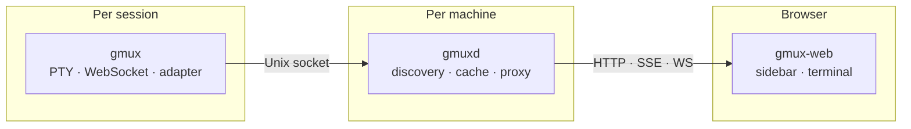
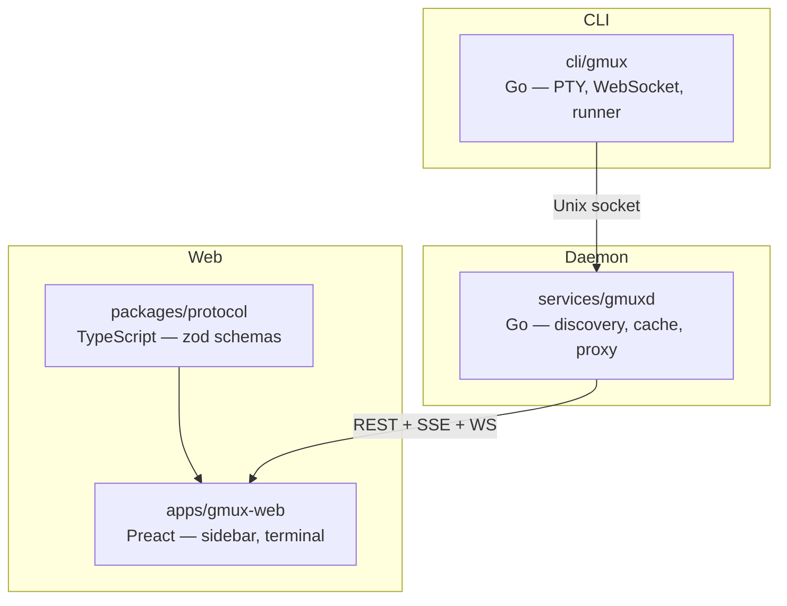

# gmux

**Keep tabs on every AI agent, test runner, and long-running process across your machines. Work from your desktop, steer from your phone.**

Launch any command as a managed session. gmux gives you a live, interactive terminal for each one — grouped by project, with real-time status updates pushed to your browser. When an agent needs input, you'll know. When tests fail, you'll see it. Switch to your phone and the same view is there, ready for you to course-correct.

No Electron, no desktop app. Just a browser and two small binaries.

## Install

```bash
brew install gmuxapp/tap/gmux
```

Or download from [GitHub Releases](https://github.com/gmuxapp/gmux/releases).

## Quick start

```bash
gmux -- pi                 # launch a coding agent
gmux -- pytest --watch     # launch a test watcher
gmux -d -- make build      # detached; prints the session id
gmux open                  # open the UI
```

Open the dashboard — all three sessions are there, grouped by project, with live status indicators. Click one to attach a full terminal. The same xterm.js that powers the VS Code terminal, running in your browser.

The daemon (`gmuxd`) starts automatically on first use. There's nothing else to set up. Power users alias `gm='gmux --'`. For daemon lifecycle commands, run `gmux daemon status` (see `gmux help`).

## How it works



**`gmux`** wraps any command in a managed session. It allocates a PTY, serves a WebSocket for terminal access, and runs an **adapter** that understands what the child process is doing. For agent tools (pi, Claude Code, Codex), gmux installs a small hook into the agent so the agent itself reports its state — working, idle, which conversation it holds — authoritatively, with no output scraping. A generic command gets alive/dead/activity tracking out of the box.

**`gmuxd`** runs once per machine (auto-started by `gmux`). It discovers sessions via their Unix sockets, caches their state, proxies WebSocket connections, and pushes real-time updates to the browser via SSE. Session state lives with each runner, so gmuxd's session cache rebuilds on restart; projects, peers, and the auth token persist in `~/.local/state/gmux`.

**`gmux-web`** is the browser UI. The sidebar groups sessions into projects, with status dots that pulse when something needs attention. The terminal is xterm.js — the same battle-tested terminal emulator that powers VS Code's integrated terminal — with synchronized output for flicker-free session switching and ~1 MiB of persisted scrollback that replays instantly on reconnect.

## What you see

```
┌─────────────────────────────────────┐
│ gmux                             ⚙  │
│                                     │
│ ▼ myapp                        ● 2  │
│                                     │
│   ● fix auth bug               now  │
│     working · pi                    │
│                                     │
│   ● test watcher             2m ago │
│     pytest --watch                  │
│                                     │
│ ▼ gmux                         ● 1  │
│                                     │
│   ● bootstrap                  5m   │
│     unread · pi                     │
│                                     │
│ ▸ docs                         ○ 1  │
└─────────────────────────────────────┘
```

Sessions are grouped into **projects** by working directory — manage the project list in Settings, where gmux also suggests directories it discovered from past sessions. Each project's status dot reflects the most urgent session inside it.

## Features

### Sessions
- **Launch anything** — `gmux -- <command>` wraps any process in a managed session
- **Full terminal** — xterm.js with WebSocket transport, the same terminal emulator as VS Code
- **~1 MiB persisted scrollback** — replays instantly on reconnect, survives runner exit, no lost context
- **Flicker-free switching** — DEC 2026 synchronized output renders session swaps in a single frame
- **Session lifecycle** — live status, exit codes, kill from the UI; dead sessions stay resumable
- **Reconnecting** — tab away, come back, the terminal is right where you left it
- **Editor tabs** — `gmux edit <file>` opens a managed editor session; works as `$EDITOR` (blocks and propagates the exit code, so `git commit` just works)

### Adapters — session-level intelligence
Adapters teach gmux how to work with specific tools. They're compiled into the binary and selected automatically by command name.

- **Auto-detection** — `gmux -- pi` recognizes pi and activates the pi adapter. No flags needed.
- **Authoritative agent status** — pi, Claude Code, and Codex report session identity, titles, and working/idle state through the tools' own hook mechanisms, injected per launch
- **Child awareness** — any tool can self-report status via `PUT /status` on `$GMUX_SOCKET`, no adapter required
- **Graceful fallback** — unknown commands get the shell adapter

### Scripting & agents
gmux is a full CLI, designed to compose into scripts and agent workflows:

```bash
id=$(gmux -d -- pi)                     # launch detached, capture the id
gmux send --wait --timeout 600 "$id" 'refactor the auth module' Enter  # send, block until the turn ends
gmux tail "$id" -n 50                   # read the plain-text tail
```

`gmux ls --json` gives agents a machine-readable session list; `gmux send-keys -t` is tmux-compatible. See the [scripting guide](apps/website/src/content/docs/integrations/scripts-and-agents.md).

### Multi-machine
Run gmux on each machine, then connect them: `gmux auth` on the remote host prints a connect URL you paste into **Settings → Hosts → Connect to host**. Peers authenticate with bearer tokens; sessions on other hosts are addressable as `<id>@<peer>`. Devcontainers running the gmux feature are discovered automatically. See [Multi-machine](apps/website/src/content/docs/multi-machine.md).

### UI
- **Triage-first** — the home screen surfaces waiting and active sessions first, then recency buckets
- **Project grouping** — sessions group into projects by working directory; manage the list in Settings
- **Find in terminal** — Cmd/Ctrl+F searches the terminal buffer
- **Mobile responsive** — same URL on your phone; a dedicated toolbar, keyboard handling, and long-press link actions
- **URL routing** — every project and session has a stable URL you can bookmark
- **Customizable theme** — dark theme with a Windows Terminal–compatible terminal palette (`theme.jsonc`)

### Architecture
- **Runner-authoritative** — each session's runner is the source of truth for its state; gmuxd's session cache is rebuilt from running sessions
- **No external dependencies** — no tmux, no screen, no abduco. Two Go binaries and a web app.
- **Web-first** — works on desktop, tablet, phone. Same URL everywhere.
- **Zero config** — run `gmux -- <command>`, open a browser

## Extensibility

- **Adapters** (Go, compiled in) — recognize commands, launch presets, titles, resume, hook-driven status
- **Child self-reporting** — any process can `PUT /status` on `$GMUX_SOCKET` to set working/error state, no adapter required

## Development

See [CONTRIBUTING.md](CONTRIBUTING.md) for prerequisites and setup.

```bash
pnpm install      # JS dependencies
pnpm dev          # start all services with watch/HMR
```

### Monorepo layout



| Path | Language | Purpose |
|------|----------|---------|
| `cli/gmux` | Go | Session launcher — PTY, WebSocket, runner |
| `services/gmuxd` | Go | Machine daemon — discovery, cache, WS proxy, embedded web UI |
| `packages/*` | Go | Shared libraries — adapters, paths, scrollback, session env |
| `apps/gmux-web` | TypeScript/Preact | Browser UI — sidebar, terminal, header bar |
| `packages/protocol` | TypeScript | Shared schemas, zod-validated |
| `apps/website` | Astro/Starlight | Documentation site |

## Docs

Documentation lives in the [website](apps/website/src/content/docs/):

- [Getting Started](apps/website/src/content/docs/getting-started.mdx) — install and first session
- [Architecture](apps/website/src/content/docs/architecture.md) — runtime structure (gmux, gmuxd, web UI)
- [CLI Reference](apps/website/src/content/docs/reference/cli.md) — every verb and flag
- [Multi-machine](apps/website/src/content/docs/multi-machine.md) — connecting hosts
- [Session Schema](apps/website/src/content/docs/develop/session-schema.md) — metadata model
- [Adapter Architecture](apps/website/src/content/docs/develop/adapter-architecture.md) — how adapters work
- [Security](apps/website/src/content/docs/security.md) — threat model and safeguards
- [Remote Access](apps/website/src/content/docs/remote-access.md) — `gmux remote` / Tailscale setup

## License

MIT
