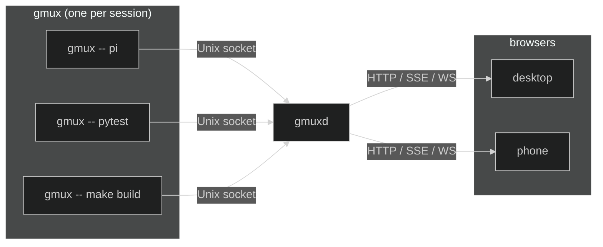

## Runtime pieces

### `gmux` — session runner

One per session. It:

- Launches the child process under a PTY
- Owns the live session state (title, status, working flag)
- Persists PTY output to an on-disk scrollback file for session replay on reconnect
- Exposes the session on a Unix socket (metadata, events, terminal attach)
- Runs the session's adapter: agents report authoritative state (conversation binding, turn phase, title) to the runner via a tool-neutral hook protocol; OSC title parsing over child output remains for everything else

`gmux` is the source of truth for a live session.

### `gmuxd` — machine daemon

One per machine. It:

- Discovers live runner sockets (`~/.local/state/gmux/run/sessions/*.sock`) — runners register themselves on startup; a periodic socket scan is the fallback (legacy socket dirs from pre-2.0 runners are scanned for one release)
- Subscribes to runner events for live updates
- Maintains a conversations index fed by adapter-owned conversation sources (e.g. pi's JSONL conversation files), used for discovery and resume
- Serves the REST API, SSE event stream, and WebSocket proxy
- Serves the embedded web frontend as a SPA
- Manages session launch, kill, dismiss, and resume
- Optionally connects to other gmuxd instances (peers) and aggregates their sessions into a single UI (see [Multi-Machine](/multi-machine/))

`gmuxd` holds no authoritative live state — live sessions are rediscovered from runner sockets on restart. It does persist lightweight per-session metadata (`~/.local/state/gmux/sessions/<id>/meta.json`) so dead sessions remain visible and resumable across restarts; scrollback for dead sessions is treated as an evictable cache (ADR 0016). On startup it hashes the `gmux` binary it ships with; sessions running a different build are marked **stale** so the UI can flag them.

`gmux` auto-starts `gmuxd` if it isn't already running. If a daemon from an older version is detected, `gmux` automatically replaces it so the child process always talks to a compatible daemon.

Configuration lives in `~/.config/gmux/host.toml`. See [Configuration](/configuration) for the full file layout, or [Security](/security) and [Remote Access](/remote-access) for details on those topics.

### Web UI

The frontend is built with Preact and xterm.js, compiled into a static bundle, and embedded into the `gmuxd` binary via `go:embed`. No separate web server or Node.js runtime is needed. It renders session state as a pure projection of the backend, see [State Management](/develop/state-management) for the data flow details.

### Shared client packages

`gmuxd` consumes its own public API for peer connections. Two small internal packages hold the protocol primitives:

- **`sseclient`** decodes Server-Sent Events from `/v1/events`. It handles `event:` / `data:` / `:` comment framing, enforces payload size limits, supports a configurable idle timeout (sliding read deadline), and calls a user-supplied handler per event. Reconnect is the caller's job, matching how the browser's `EventSource` works.
- **`apiclient`** is a typed wrapper around the public gmuxd API: `GetHealth`, `ForwardAction`, `ForwardLaunch`, `DialWS`, `ProxyWS`, plus `Events` which returns a configured `sseclient`. It sets bearer auth once and accepts an `http.RoundTripper` so peer traffic can route through an alternative transport such as `tsnet`.

Peer daemons use these packages to talk to other gmuxd instances. There are no peer-only endpoints: if the browser path works, the peer path works, because they both flow through the same code. Read limits, auth, error handling, and keepalive live in one place instead of being duplicated per consumer.

## Data flow

Each `gmux` runner exposes its session on a Unix socket. `gmuxd` discovers these sockets, subscribes to each runner's event stream for live updates, and proxies everything to the browser. When you click a session, the browser opens a WebSocket that gmuxd proxies to the runner's socket, so terminal I/O flows end-to-end.

## Scrollback replay

Two distinct mechanisms back replay, and they should not be conflated:

- **On-connect emulator snapshot** — the runner keeps a virtual terminal (line-bounded, ~2000 lines via `SetScrollbackSize`) of the live session. When a browser connects or switches sessions, the runner sends this snapshot so the terminal shows the session's current state immediately. Screen clears reset the emulator, and TUI frame boundaries are detected so replay starts at a clean frame. This snapshot lives only while the runner is alive.

- **Persisted on-disk scrollback** — the runner also appends raw PTY bytes to an on-disk scrollback file (`packages/scrollback`). This is **not a ring buffer**: it's an append-only active file that rotates when it exceeds `MaxBytes` (1 MiB). On rotation the active file is renamed to `scrollback.0` and a fresh active file is opened, so total on-disk usage is bounded at `2 * MaxBytes` (2 MiB). Because it lives on disk, this scrollback survives runner exit and serves post-mortem replay for dead sessions.

## API surface

Served by `gmuxd` on a Unix socket (local IPC) and a TCP listener (default `127.0.0.1:8790`, token-authenticated; cookie-authed mutations and WebSocket upgrades additionally enforce same-origin — see [Security](/security)). This is a non-exhaustive overview of the main endpoints:

| Endpoint | Purpose |
|---|---|
| `GET /v1/sessions` | List all sessions (tooling/scripts; the web UI uses SSE snapshots instead) |
| `PUT /v1/projects` | Replace project list |
| `POST /v1/projects/add` | Add a discovered project |
| `PATCH /v1/projects/{slug}/sessions` | Reorder sessions within a project (partial-reorder merge) |
| `GET /v1/frontend-config` | User settings + theme (from JSONC files) |
| `POST /v1/launch` | Launch a new session |
| `POST /v1/sessions/{id}/kill` | Kill a session |
| `POST /v1/sessions/{id}/dismiss` | Kill + remove |
| `POST /v1/sessions/{id}/resume` | Resume a resumable session |
| `POST /v1/sessions/{id}/{input,read,scrollback,wait,...}` | Other session actions (input injection, tail, wait-for-idle, …) |
| `GET /v1/conversations/{adapter}/{slug}` | Conversation lookup for resume |
| `POST /v1/peers` / `DELETE /v1/peers/{name}` | Add / remove a peer host |
| `POST /v1/register` / `POST /v1/deregister` | Runner registration fast path |
| `GET /v1/events` | SSE: `snapshot.sessions`, `snapshot.world`, `session-activity` (ADR 0001) |
| `/v1/peers/{peer}/...` | Forward an allowlisted write to a peer (ADR 0002) |
| `GET /v1/health` | Daemon health, version, launchers, peer status |
| `WS /ws/{id}` | Terminal WebSocket proxy |
| `GET /` | Embedded web UI (SPA) |

