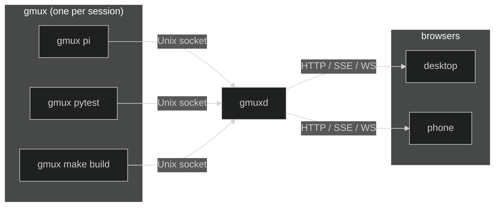

## Runtime pieces

### `gmux` — session runner

One per session. It:

- Launches the child process under a PTY
- Owns the live session state (title, status, working flag)
- Maintains a scrollback ring buffer for session replay on reconnect
- Exposes the session on a Unix socket (metadata, events, terminal attach)
- Runs adapter logic over child output

`gmux` is the source of truth for a live session.

### `gmuxd` — machine daemon

One per machine. It:

- Discovers live runner sockets (`/tmp/gmux-sessions/*.sock`)
- Subscribes to runner events for live updates
- Watches adapter session files (e.g. pi's JSONL conversations)
- Serves the REST API, SSE event stream, and WebSocket proxy
- Serves the embedded web frontend as a SPA
- Manages session launch, kill, dismiss, and resume
- Optionally connects to other gmuxd instances (peers) and aggregates their sessions into a single UI (see [Multi-Machine](/multi-machine/))

`gmuxd` is stateless — if it restarts, it rediscovers running sessions. On startup it hashes the `gmux` binary it ships with; sessions running a different build are marked **stale** so the UI can flag them.

`gmux` auto-starts `gmuxd` if it isn't already running. If a daemon from an older version is detected, `gmux` automatically replaces it so the child process always talks to a compatible daemon.

Configuration lives in `~/.config/gmux/host.toml`. See [Configuration](/configuration) for the full file layout, or [Security](/security) and [Remote Access](/remote-access) for details on those topics.

### Web UI

The frontend is built with Preact and xterm.js, compiled into a static bundle, and embedded into the `gmuxd` binary via `go:embed`. No separate web server or Node.js runtime is needed. It renders session state as a pure projection of the backend, see [State Management](/develop/state-management) for the data flow details.

### Shared client packages

`gmuxd` consumes its own public API for peer connections. Two small internal packages hold the protocol primitives:

- **`sseclient`** decodes Server-Sent Events from `/v1/events`. It handles `event:` / `data:` / `:` comment framing, enforces payload size limits, and calls a user-supplied handler per event. Reconnect is the caller's job, matching how the browser's `EventSource` works.
- **`apiclient`** is a typed wrapper around the public gmuxd API: `GetConfig`, `ForwardAction`, `ForwardLaunch`, `DialWS`, `ProxyWS`, plus `Events` which returns a configured `sseclient`. It sets bearer auth once and accepts an `http.RoundTripper` so Tailscale-discovered peers can route through `tsnet`.

Peer daemons use these packages to talk to other gmuxd instances. There are no peer-only endpoints: if the browser path works, the peer path works, because they both flow through the same code. Read limits, auth, error handling, and keepalive live in one place instead of being duplicated per consumer.

## Data flow

Each `gmux` runner exposes its session on a Unix socket. `gmuxd` discovers these sockets, subscribes to each runner's event stream for live updates, and proxies everything to the browser. When you click a session, the browser opens a WebSocket that gmuxd proxies to the runner's socket, so terminal I/O flows end-to-end.

## Scrollback replay

Each runner maintains a 128KB ring buffer that captures PTY output. When a browser connects or switches sessions, the runner sends the buffered content so the terminal shows the session's current state immediately. Screen clears reset the buffer, and TUI frame boundaries are detected so replay starts at a clean frame.

## API surface

Served by `gmuxd` on a Unix socket (local IPC) and a TCP listener (default `127.0.0.1:8790`, token-authenticated):

| Endpoint | Purpose |
|---|---|
| `GET /v1/sessions` | List all sessions |
| `GET /v1/projects` | Get project configuration |
| `PUT /v1/projects` | Replace project list |
| `POST /v1/projects/add` | Add a discovered project |
| `GET /v1/config` | Launcher configuration |
| `GET /v1/frontend-config` | User settings + theme (from JSONC files) |
| `POST /v1/launch` | Launch a new session |
| `POST /v1/sessions/{id}/kill` | Kill a session |
| `POST /v1/sessions/{id}/dismiss` | Kill + remove |
| `POST /v1/sessions/{id}/resume` | Resume a resumable session |
| `GET /v1/events` | SSE stream of session and project changes |
| `GET /v1/health` | Daemon health check |
| `GET /v1/peers` | Connected and offline peer status |
| `WS /ws/{id}` | Terminal WebSocket proxy |
| `GET /` | Embedded web UI (SPA) |

