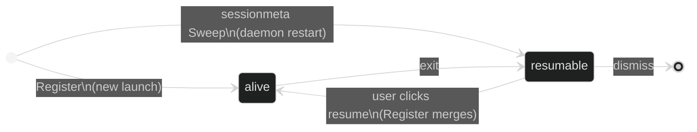

Session state flows one way: runners (and their agent hooks) produce it, `gmuxd` aggregates it in a store, and the frontend renders it. The frontend never modifies session state — it sends actions and waits for the backend to broadcast the result.

## The store

`gmuxd` holds all sessions in an in-memory store. Every mutation goes through `store.Upsert(session)`, which:

1. Derives computed fields (`title`, `resumable`, `last_activity_at`)
2. Writes the session under a lock
3. Notifies in-process subscribers with a `session-upsert` event. The SSE layer coalesces these into full `snapshot.sessions` payloads for browsers (protocol 2, ADR 0001).

A byte-identical write is detected in the commit path and never broadcast — this no-op dedup is load-bearing for the snapshot protocol. `store.Remove(id)` notifies with `session-remove`. Other writers (`Update`, `UpsertRemote`, `Reconcile`, peer removals) all route through the same commit path, which is where dedup and slug resolution live.

### `Upsert` vs `UpsertRemote`

Sessions owned by a peer go through `store.UpsertRemote` instead of `store.Upsert`. The difference is that `UpsertRemote` does **not** re-run `resolveTitle` or re-derive `resumable`: those fields were already authoritatively resolved on the spoke and arrive in the SSE payload. It also skips `last_activity_at` recomputation — the stamp arrives in the peer payload. Canonicalization, duplicate-slug handling, unique-slug numbering, and the broadcast all still run.

This split exists because the spoke keeps `shell_title` and `adapter_title` as internal fields and drops them in `MarshalJSON`. If the hub called `Upsert` on a remote session it would see those fields empty, fall through to the `CommandTitler` or the bare adapter name, and overwrite the correct spoke-resolved `title`. `UpsertRemote` trusts the spoke. The alternative, putting the internal title fields on the wire, was rejected: it widens the public API surface for a purely internal concern.

## Who writes what

Each field on a session has a single owner. No two subsystems write the same field.

| Transition | Owner | Trigger |
|---|---|---|
| Session appears (live) | **Register** | Runner calls `POST /v1/register` |
| Session reappears after restart (dead) | **sessionmeta Sweep** | `meta.json` loaded at startup |
| Metadata updates | **Subscription** | Runner SSE `status` / `meta` events |
| Held file + title + status | **Agent hook** | runner SSE `conversation_file` / `status` events |
| Session dies (clean exit) | **Subscription** | Runner SSE `exit` event |
| Session dies (crash) | **Discovery Scan** | Socket file gone |
| Session removed | **Dismiss handler** | User clicks × |
| Activity stamp | **Store** | `last_activity_at` on noteworthy transitions |

### Register: single entry point for live sessions

All live session creation flows through `Register()`. It queries the runner's `/meta` endpoint, creates or merges the session, and starts an SSE subscription. Both the `POST /v1/register` HTTP handler and the discovery scan delegate to it.

For resumed sessions, the daemon launches the runner with `--resume-id` (ADR 0003): the runner registers under the same session ID and `Register()` lands in its re-registration merge branch, which overwrites only runtime-owned fields and preserves slug, creation time, and the hook-reported title. Resume also preserves PTY size hints and falls back to the project's canonical folder when the original cwd is gone.

### Discovery Scan: consistency check, not session creator

Scan runs every 3 seconds (plus once at startup, with a first-scan hook) and does two things:

1. **New sockets** → delegates to `Register()` (never creates sessions directly)
2. **Missing sockets** → marks alive sessions as dead

This means discovery can never race with Register to create duplicate sessions.

### Agent hook: authoritative live state

Live session state is reported by the agent itself, not inferred by the daemon. The runner injects a gmux hook into the agent (`pi -e`, or codex/claude hooks), and the agent POSTs the held conversation, title, and status to the runner socket; the runner forwards them over SSE. `gmuxd` records the conversation's ref on the session (`ConversationRef`). A `/resume` rebind to a different conversation is just another report. Tools that can't be hooked run without daemon-reported live state — there is no metadata-matching fallback.

### Conversation sources: index updates

Separately, each file-backed adapter implements `ConversationSource` to keep the conversations index (URL resolution + search) current: a snapshot at startup, then incremental create/change/remove events via the shared `filewatch` watcher. This covers dead conversations that have no running session, which the hook path cannot.

### sessionmeta: dead-session persistence

Dead sessions survive daemon restarts. When a session lands alive→dead, gmuxd writes `$XDG_STATE_HOME/gmux/sessions/<id>/meta.json`; at startup a Sweep loads those back into the store as `Alive=false`. Retention (ADR 0016): `meta.json` mirrors conversation-file existence, conversation-less sessions (shells) age out (30 days / 200 max by default), and dead-session scrollback is a cache with an aggregate byte cap. A separate 30-second maintenance pass purges ephemeral dead sessions that never bound a conversation file. There is no periodic scan of adapter conversation directories creating sessions — that mechanism was retired; the conversations index handles dead-conversation URL resolution.

## Session lifecycle



**Key transitions:**

- **alive → resumable:** Subscription receives exit event from the runner, or discovery finds the socket gone. All dead sessions with a command are immediately resumable. For adapters with native resume (pi, claude, codex), the exit handler replaces the command with the tool-specific resume command. For others, the original command is kept.
- **resumable → alive:** User clicks the session. The resume handler launches a runner with the session's command but does **not** modify the store. When the runner registers, `Register()` merges it back to alive.
- **resumable → dismissed:** Dismiss kills any live runner, runs the adapter's `OnDismiss`, removes project membership, and deletes the persisted meta dir — so a dismissed session stays gone, including across daemon restarts.
- **Editor sessions** (`gmux edit`) are an exception: they're dismissed automatically when the editor closes, never becoming resumable.

## Derived fields

These are computed in `Upsert()` and `Update()`, never set manually:

| Field | Derivation |
|---|---|
| `title` | `adapter_title` > `shell_title` > `CommandTitler` > adapter name |
| `resumable` | `!alive && has command` |
| `last_activity_at` | stamped on noteworthy transitions (exit, unread on, working/error on) |

Staleness (the "outdated" badge) is **frontend-derived**: the UI compares each session's `runner_version`/`binary_hash` against `/v1/health`. There is no `stale` store field.

All dead sessions with a command are resumable, regardless of adapter. The exit handler swaps in a tool-specific resume command only for sessions with a recorded conversation file (adapters implementing `Resumer`); everything else keeps the original launch command, so "resume" re-runs it in the same working directory.

**Title priority:** `adapter_title` always wins over `shell_title`. An empty `adapter_title` from the runner never overwrites a non-empty one on the daemon, preserving titles across resume where the daemon knows the title but the freshly-started runner doesn't yet. The next fallback is the adapter's `CommandTitler` interface (shell uses this to show `pytest -x`). The final fallback is the adapter name (e.g. "codex").

**Internal vs API-visible fields.** Several fields are internal to gmuxd and excluded from the API response via `MarshalJSON`. Their derived outputs are exposed instead. See the [field map](/develop/session-schema#field-map) for the full breakdown.

## Frontend architecture

The frontend is a projection of backend state. Session state arrives exclusively via a single `EventSource('/v1/events')` (protocol 2, ADR 0001):

1. `snapshot.sessions` — full replacement of the session list (a leading-edge snapshot arrives on connect, so there is no bulk-GET prefetch)
2. `snapshot.world` — projects, peers, health, launchers, peer projects
3. `session-activity` — bare `{id}` ping, lossy by design

Reconnect is trivial: the browser's `EventSource` auto-reconnects, and since every snapshot is a full replacement, missed deltas don't matter. (`GET /v1/sessions` still exists for the CLI and scripts.)

Mutations use a bounded **optimistic overlay**: mark-read, dismiss, and reorder are stacked as pending mutations and replayed on top of incoming raw snapshots until the server echoes them back or a 5-second TTL expires. The UI feels instant, and a failed action self-heals back to server truth (plus an error toast).

### UI state (frontend-owned)

Two pieces of state are local to the frontend and not part of the session model:

```typescript
selectedId: string | null   // which session the terminal shows
resumingId: string | null   // which session has a resume in flight
```

**`selectedId`** — derived from the URL: selection *is* routing (`navigateToSession`). The view resolves only after both snapshots load, so a deep session URL survives a refresh.

**`resumingId`** — set when the user clicks a resumable session. Shows a pulsing dot on the sidebar row while waiting for the backend to confirm the session is alive. Cleared when the SSE upsert arrives with `alive: true` and a valid `socket_path`, or after a 10-second timeout.

### canAttach

The terminal renders when `selected.alive && (selected.socket_path || selected.peer)` is true. This means:

- Dead/resumable sessions: no live terminal — the replay view shows persisted scrollback with a Resume/Rerun action
- Alive but no socket yet: impossible for local sessions — `Register()` sets both `alive` and `socket_path` atomically; peer sessions have no local socket and attach through the hub proxy instead
- Alive with socket: terminal connects via WebSocket proxy

## Status

Status carries only granular booleans (`working`, `error`) and is **null by default**. It describes *live* state; display text is the frontend's concern, derived from these plus `exit_code`.

| State | What the UI shows | Status field |
|---|---|---|
| Alive, idle | Steady dot | `null` |
| Alive, working | Pulsing dot + header "Working…" | `{ working: true }` |
| Alive, error | Red dot + header "Error" | `{ working: false, error: true }` |
| Dead, clean exit | Dimmed row, "Session ended" | `null` |
| Dead, non-zero exit | Dimmed row, "exited (N)" from `exit_code` | `null` |
| Resumable | Normal row, clickable | `null` |

Exit text (`exited (N)` / `Session ended`) is derived in the frontend from `exit_code`, not carried in Status. On exit the daemon sets Status to `null`.
