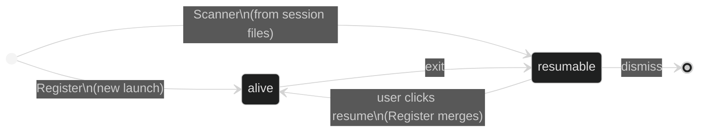

Session state flows one way: runners (and their agent hooks) produce it, `gmuxd` aggregates it in a store, and the frontend renders it. The frontend never modifies session state — it sends actions and waits for the backend to broadcast the result.

## The store

`gmuxd` holds all sessions in an in-memory store. Every mutation goes through `store.Upsert(session)`, which:

1. Derives computed fields (`title`, `resumable`)
2. Writes the session under a lock
3. Broadcasts a `session-upsert` SSE event to all connected browsers

`store.Remove(id)` broadcasts `session-remove`. There are no other write paths.

### `Upsert` vs `UpsertRemote`

Sessions owned by a peer go through `store.UpsertRemote` instead of `store.Upsert`. The difference is that `UpsertRemote` does **not** re-run `resolveTitle` or re-derive `resumable`: those fields were already authoritatively resolved on the spoke and arrive in the SSE payload. Canonicalization, duplicate-resume-key handling, unique-resume-key numbering, and the broadcast all still run.

This split exists because the spoke keeps `shell_title` and `adapter_title` as internal fields and drops them in `MarshalJSON`. If the hub called `Upsert` on a remote session it would see those fields empty, fall through to the `CommandTitler` or the bare `kind` string, and overwrite the correct spoke-resolved `title`. `UpsertRemote` trusts the spoke. The alternative, putting the internal title fields on the wire, was rejected: it widens the public API surface for a purely internal concern.

## Who writes what

Each field on a session has a single owner. No two subsystems write the same field.

| Transition | Owner | Trigger |
|---|---|---|
| Session appears (live) | **Register** | Runner calls `POST /v1/register` |
| Session appears (from file) | **Scanner** | Periodic scan of adapter session directories |
| Metadata updates | **Subscription** | Runner SSE `status` / `meta` events |
| Held file + title + status | **Agent hook** | runner SSE `session_file` / `status` events |
| Session dies (clean exit) | **Subscription** | Runner SSE `exit` event |
| Session dies (crash) | **Discovery Scan** | Socket file gone |
| Session removed | **Dismiss handler** | User clicks × |

### Register: single entry point for live sessions

All live session creation flows through `Register()`. It queries the runner's `/meta` endpoint, creates or merges the session, and starts an SSE subscription. Both the `POST /v1/register` HTTP handler and the discovery scan delegate to it.

For resumed sessions, `Register()` merges the new runner into the existing store entry (keeping the original ID and resume key) via the `PendingResumes` mechanism.

### Discovery Scan: consistency check, not session creator

Scan runs every 3 seconds and does two things:

1. **New sockets** → delegates to `Register()` (never creates sessions directly)
2. **Missing sockets** → marks alive sessions as dead

This means discovery can never race with Register to create duplicate sessions.

### Agent hook: authoritative live state

Live session state is reported by the agent itself, not inferred by the daemon. The runner injects a gmux hook into the agent (`pi -e`, or codex/claude hooks), and the agent POSTs the held conversation file, title, and status to the runner socket; the runner forwards them over SSE. `gmuxd` records the file on the session (`SessionFile`). A `/resume` rebind to a different file is just another report. Tools that can't be hooked run without daemon-reported live state — there is no metadata-matching fallback.

### Conversation sources: index updates

Separately, each file-backed adapter implements `ConversationSource` to keep the conversations index (URL resolution + search) current: a snapshot at startup, then incremental create/change/remove events via the shared `filewatch` watcher. This covers dead conversations that have no running session, which the hook path cannot.

### Scanner: file-discovered sessions

Runs every 30 seconds. Enumerates adapter session files on disk (e.g. `~/.claude/projects/`) and creates resumable entries for sessions not already in the store. Respects the dismissed set — sessions the user removed won't reappear.

## Session lifecycle



**Key transitions:**

- **alive → resumable:** Subscription receives exit event from the runner, or discovery finds the socket gone. All dead sessions with a command are immediately resumable. For adapters with native resume (pi, claude, codex), the exit handler replaces the command with the tool-specific resume command. For others, the original command is kept.
- **resumable → alive:** User clicks the session. The resume handler launches a runner with the session's command but does **not** modify the store. When the runner registers, `Register()` merges it back to alive.
- **resumable → dismissed:** Resumable sessions in the "Resume previous" drawer can be dismissed with ×. Dismissed resume keys are tracked in memory so the scanner doesn't re-add them. Restarting `gmuxd` clears this set.

## Derived fields

These are computed in `Upsert()` and `Update()`, never set manually:

| Field | Derivation |
|---|---|
| `title` | `adapter_title` > `shell_title` > `CommandTitler` > adapter kind |
| `resumable` | `!alive && has command` |
| `stale` | `binary_hash` differs from gmuxd's expected runner hash |

All dead sessions with a command are resumable, regardless of adapter kind. Adapters with native resume (pi, claude, codex) provide tool-specific resume commands via the `Resumer` interface. Adapters without it (shell) keep the original launch command, so "resume" re-runs it in the same working directory.

**Title priority:** `adapter_title` always wins over `shell_title`. An empty `adapter_title` from the runner never overwrites a non-empty one on the daemon, preserving titles across resume where the daemon knows the title from file attribution but the freshly-started runner doesn't yet. The next fallback is the adapter's `CommandTitler` interface (shell uses this to show `pytest -x`). The final fallback is the adapter kind name (e.g. "codex").

**Internal vs API-visible fields.** Several fields are internal to gmuxd and excluded from the API response via `MarshalJSON`. Their derived outputs are exposed instead. See the [field map](/develop/session-schema#field-map) for the full breakdown.

## Frontend architecture

The frontend is a pure projection of backend state. Session state arrives exclusively via:

1. `GET /v1/sessions` — initial fetch on page load
2. SSE `session-upsert` — real-time updates
3. SSE `session-remove` — real-time removals
4. SSE reconnect — re-fetches all sessions

There are **no optimistic updates**. When the user clicks dismiss, the frontend sends `POST /v1/sessions/{id}/dismiss` and waits for the `session-remove` SSE event. On localhost the round-trip is <10ms — imperceptible.

### UI state (frontend-owned)

Two pieces of state are local to the frontend and not part of the session model:

```typescript
selectedId: string | null   // which session the terminal shows
resumingId: string | null   // which session has a resume in flight
```

**`selectedId`** — set on click, cleared when the selected session dies. Only sessions with `alive && socket_path` can be selected (the terminal needs a socket to connect to). Auto-selected on initial load for the first attachable session.

**`resumingId`** — set when the user clicks a resumable session. Shows a pulsing dot on the sidebar row while waiting for the backend to confirm the session is alive. Cleared when the SSE upsert arrives with `alive: true` and a valid `socket_path`, or after a 10-second timeout.

### canAttach

The terminal renders when `selected.alive && selected.socket_path` is true. This means:

- Dead/resumable sessions: no terminal, empty state shown
- Alive but no socket yet: impossible — `Register()` always sets both `alive` and `socket_path` atomically
- Alive with socket: terminal connects via WebSocket proxy

## Status

Status carries only granular booleans (`working`, `error`) and is **null by default**. It describes *live* state; display text is the frontend's concern, derived from these plus `exit_code`.

| State | What the UI shows | Status field |
|---|---|---|
| Alive, idle | Steady dot | `null` |
| Alive, working | Pulsing dot + header "Working…" | `{ working: true }` |
| Alive, error | Red dot + header "Error" | `{ working: false, error: true }` |
| Dead, clean exit | Dimmed row, "Session ended" | `null` |
| Dead, non-zero exit | Dimmed row, "exited (N)" from `exit_code` | `null` |
| Resumable | Normal row, clickable | `null` |

Exit text (`exited (N)` / `Session ended`) is derived in the frontend from `exit_code`, not carried in Status. On exit the daemon sets Status to `null`.
