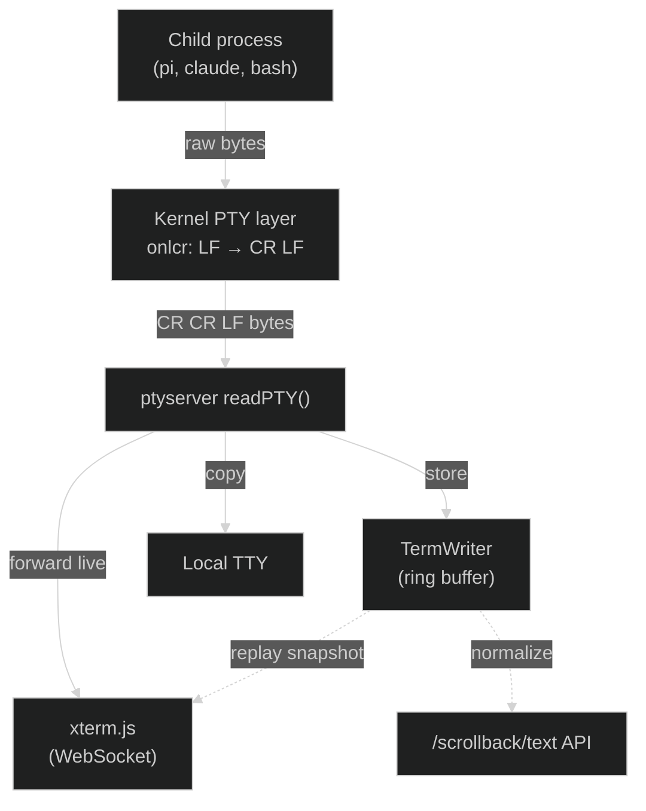

This page traces what happens between a TUI program printing bytes and those bytes appearing on screen. It covers the three ways a user can observe a gmux session, and explains the scrollback buffer that ties them together.

## The full path

### 1. Child process writes to stdout/stderr

The child (pi, claude, bash) writes raw bytes. These are terminal escape sequences, UTF-8 text, cursor movement commands, colors, and so on. The child has no knowledge of gmux.

### 2. Kernel PTY line discipline

The bytes pass through the kernel's PTY layer before reaching the master file descriptor that ptyserver reads. The PTY applies **line discipline** transformations. The most important one:

**`onlcr` (output NL to CR-NL):** The kernel translates every `\n` (LF) into `\r\n` (CR LF). This means if a child writes `\r\n` explicitly (common in TUI apps), it becomes `\r\r\n` on the master side.

This is transparent in normal terminal usage, but it matters for scrollback recording because `\r` has special meaning (carriage return, move cursor to column 0).

### 3. ptyserver reads from the PTY master

The `readPTY()` goroutine reads chunks from the PTY master fd. It coalesces rapid bursts (up to 8ms or 32KB) into a single chunk to reduce WebSocket message count, then:

1. Runs adapter hooks (title detection, status monitoring)
2. Writes the chunk to the **TermWriter** (scrollback buffer)
3. Copies the chunk to all connected **WebSocket clients** (live viewers)
4. Copies the chunk to the **local TTY** output (if attached)

The raw bytes are forwarded unmodified to WebSocket clients and the local TTY. Only the TermWriter processes them for storage.

## Three viewing paths

### Local TTY (direct attach)

When you run `gmux` in a terminal, the local terminal is attached as both input and output. PTY output bytes are copied directly to your terminal's stdout. Your terminal emulator (kitty, iTerm2, etc.) interprets the escape sequences and renders them.

**Data flow:** PTY master → `readPTY()` → `localOut.Write(data)` → your terminal

No filtering or transformation. You see exactly what the child process produces (after PTY line discipline).

### xterm.js (WebSocket viewer)

When you open the gmux web UI or connect from another machine, the browser runs xterm.js. On connection:

1. The server sends a **scrollback replay frame**: synchronized update begin, reset sequences (clear scroll region, cursor home, erase display, erase scrollback), the full TermWriter snapshot, then synchronized update end.
2. After replay, live chunks are forwarded in real time via WebSocket binary messages.

**Data flow (replay):** TermWriter.Snapshot() → WebSocket → xterm.js
**Data flow (live):** PTY master → `readPTY()` → WebSocket → xterm.js

The replay frame includes `ESC[2J` and `ESC[3J` (erase display and scrollback) before the snapshot content. This ensures the connecting client starts from a clean slate, then sees the buffered output. Any clear sequences stored in the scrollback are processed by xterm.js naturally.

### Scrollback text API (`/scrollback/text`)

The scrollback text endpoint returns the TermWriter snapshot with ANSI sequences stripped and whitespace normalized. This is used for:

- **Session file attribution:** matching terminal content to JSONL session files
- **Content similarity:** determining which session a file belongs to

**Data flow:** TermWriter.Snapshot() → `NormalizeScrollback()` (strip ANSI, collapse whitespace) → plain text

## The TermWriter

The TermWriter sits between the raw PTY output and the ring buffer. Its job is to store a compact, meaningful representation of terminal output by collapsing content that has been visually overwritten.

### What it does

**Spinner collapsing.** When a program writes `frame1\rframe2\rframe3`, only `frame3` is stored. The bare `\r` (carriage return not followed by line feed) signals that the program is overwriting the current line. Earlier frames are discarded.

**Line buffering.** Content is accumulated in a pending buffer until a newline (`\n` or `\r\n`) arrives, then the complete line is flushed to the ring buffer. This ensures that mid-line overwrites (spinners) are fully resolved before storage.

**PTY onlcr awareness.** The sequence `\r\r\n` (produced when a TUI writes `\r\n` through a PTY with onlcr enabled) is treated as a single CRLF line terminator. More generally, any run of `\r` characters followed by `\n` is treated as CRLF. Only `\r` followed by a non-CR, non-LF byte triggers overwrite collapsing.

### What it does NOT do

**Screen clear handling.** Clear sequences (`ESC[2J`, `ESC[3J`) are passed through as regular content. They are not used to reset the ring buffer. TUI apps like pi and claude use these sequences as part of normal rendering (redrawing the screen after state changes). Resetting on clears would destroy conversation content. WebSocket clients that replay the scrollback process the clear sequences themselves, so the visual result is correct.

**Cursor movement.** The TermWriter does not interpret cursor positioning sequences (`ESC[H`, `ESC[nA`, `ESC[row;colH`, etc.). These are stored as regular bytes. A full virtual terminal emulator would be needed to track cursor position, which is out of scope. The trade-off is that TUI redraws accumulate in the buffer (each render cycle adds content), but the ring buffer's fixed size (128KB) naturally evicts old content.

**Alternate screen buffer.** The TermWriter does not track `ESC[?1049h` (enter alt screen) or `ESC[?1049l` (leave alt screen). Content from both the main and alternate screen buffers is stored in the same ring buffer.

### Ring buffer

The underlying storage is a fixed-size circular buffer (default 128KB). When full, new writes overwrite the oldest data. This provides natural eviction without explicit management, keeping memory usage bounded regardless of how much output the child produces.

## Example: what happens when pi renders a response

1. Pi's Bubble Tea TUI computes a view string containing the full screen layout.
2. Pi writes cursor movement sequences to go back to the top of the view, then writes each line followed by `\r\n`.
3. The PTY kernel converts each `\r\n` to `\r\r\n` (onlcr).
4. ptyserver's `readPTY()` reads a chunk containing multiple lines.
5. The TermWriter sees `\r\r\n` at the end of each line, recognizes it as CRLF (not a bare CR), and flushes each line to the ring buffer.
6. Spinner lines like `⠋ Working...\r⠙ Working...\r⠹ Working...` are collapsed: only `⠹ Working...` survives.
7. When pi finishes the response and does a full-screen clear (`ESC[2J ESC[3J`), these bytes are stored in the ring buffer as regular content. The pre-clear conversation content remains.
8. A WebSocket client connecting at this point receives the full ring buffer snapshot. xterm.js processes the clear sequences, showing only the post-clear content on screen, but the conversation text is still available via the `/scrollback/text` API.
