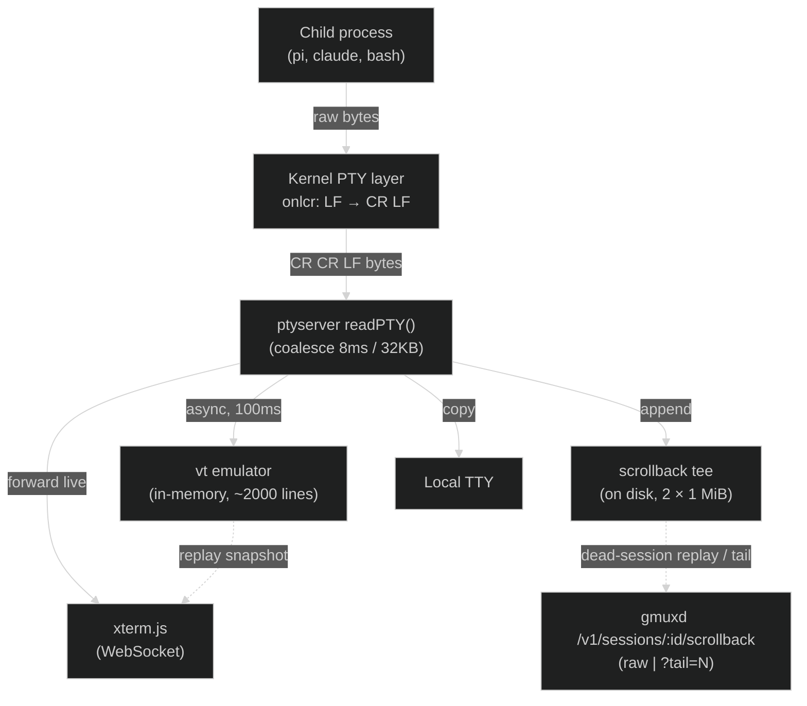

This page traces what happens between a TUI program printing bytes and those bytes appearing on screen. It covers the four ways a user can observe a gmux session, and the two storage layers that back replay.

## The full path

### 1. Child process writes to stdout/stderr

The child (pi, claude, bash) writes raw bytes. These are terminal escape sequences, UTF-8 text, cursor movement commands, colors, and so on. The child has no knowledge of gmux.

### 2. Kernel PTY line discipline

The bytes pass through the kernel's PTY layer before reaching the master file descriptor that ptyserver reads. The PTY applies **line discipline** transformations. The most important one:

**`onlcr` (output NL to CR-NL):** The kernel translates every `\n` (LF) into `\r\n` (CR LF). This means if a child writes `\r\n` explicitly (common in TUI apps), it becomes `\r\r\n` on the master side. This mostly matters for understanding how the emulator's rendered snapshot joins rows back into `\r\n`-terminated lines.

### 3. ptyserver reads from the PTY master

The `readPTY()` goroutine reads chunks from the PTY master fd. It coalesces rapid bursts (up to 8ms or 32KB) into a single chunk to reduce WebSocket message count, then:

1. Runs adapter hooks (OSC title parsing, `Adapter.Monitor`)
2. Appends the chunk to a pending buffer that feeds the **virtual terminal emulator** (drained asynchronously every 100ms, and synchronously when a client connects)
3. Emits an activity signal when no client is watching
4. Copies the chunk to the **local TTY** output (if attached)
5. Appends the chunk to the **on-disk scrollback tee**
6. Copies the chunk to all connected **WebSocket clients** (live viewers)

The raw bytes are forwarded unmodified to WebSocket clients, the local TTY, and the scrollback file. Only the emulator interprets them.

## Two storage layers

### In-memory: the vt emulator

The runner feeds all output into a full virtual terminal emulator (`charmbracelet/x/vt`) with a ~2000-line scrollback. Because it is a real VT implementation, carriage returns, cursor movement, screen clears, and the alternate screen all behave like a genuine terminal: overwritten spinner frames simply vanish from the cell grid, and the emulator always holds the session's *current visual state*.

Its one job is **connect-time replay for live sessions**: when a client attaches, the runner renders the emulator's scrollback plus visible screen into a snapshot frame. It lives only while the runner is alive.

### On disk: the scrollback tee

Independently, the runner appends every raw chunk to `$XDG_STATE_HOME/gmux/sessions/<id>/scrollback` (`packages/scrollback`). The format is raw PTY bytes with no framing. It's an append-only active file that rotates to `scrollback.0` when it exceeds 1 MiB, bounding disk usage at 2 MiB per session.

The tee is deliberately dumb — clears and alt-screen switches are stored verbatim; whoever replays the bytes interprets them. Because it lives on disk, it survives runner exit and backs **dead-session replay**. For dead sessions it's treated as an evictable cache: an aggregate budget (`GMUX_SCROLLBACK_CACHE_MB`, default 256 MB) evicts scrollback oldest-first while the session metadata survives (ADR 0016).

## Four viewing paths

### Local TTY (direct attach)

When you launch a session with `gmux -- <cmd>` or attach with `gmux attach <id>`, the local terminal is wired as input and output. PTY output bytes are copied directly to your terminal's stdout; your terminal emulator (kitty, iTerm2, etc.) interprets them.

**Data flow:** PTY master → `readPTY()` → `localOut.Write(data)` → your terminal

### xterm.js (live WebSocket viewer)

When you open the gmux web UI, the browser runs xterm.js. On connection:

1. The server sends a **replay frame**: synchronized-update begin (`ESC[?2026h`), reset sequences (clear scroll region, cursor home, erase display + scrollback), the emulator's rendered snapshot (scrollback lines plus the visible screen, style-diffed), the cursor position and visibility, then synchronized-update end. The snapshot is a *rendered reconstruction* — clears were already applied by the emulator, so the client starts from exactly the session's current state in a single frame.
2. After replay, live chunks are forwarded in real time via WebSocket binary messages.

**Data flow (replay):** vt emulator → `renderScreen()` → WebSocket → xterm.js
**Data flow (live):** PTY master → `readPTY()` → WebSocket → xterm.js

One subtle trick: when the last viewer disconnects, the PTY is shrunk by one column so the next client's resize forces a full TUI redraw — this resynchronizes anything the emulator can't reconstruct (e.g. kitty graphics).

### Dead-session replay (browser)

For exited sessions, the browser's read-only replay view streams the on-disk scrollback from gmuxd (`GET /v1/sessions/<id>/scrollback`) into xterm.js (capped at the last 2000 lines). The raw bytes include any clear sequences the program emitted; xterm.js processes them naturally. Since alive and resumable sessions share unified terminal chrome, this looks like the live terminal with a Resume/Rerun action.

### Rendered tail (`gmux tail` / `?tail=N`)

`gmux tail <id>` and `GET /v1/sessions/<id>/scrollback?tail=N` return a plain-text rendering of the last N lines: gmuxd replays the on-disk bytes through an emulator sized to the session's last known dimensions (falling back to 80×24), collapsing overwrites, stripping ANSI, and trimming trailing blanks. It works identically for live and dead sessions.

## Escape sequence handling in the web client

xterm.js handles most escape sequences natively. The gmux web client registers additional handlers for sequences that need browser integration.

### OSC 52: clipboard

Applications write `ESC ] 52 ; c ; <base64> BEL` to set the system clipboard. This is the standard mechanism used by pi (`/copy`), tmux, vim, and SSH sessions to transfer text to the user's clipboard without direct OS access.

xterm.js does not handle OSC 52 natively. The web client registers a parser handler via `term.parser.registerOscHandler(52, ...)` that decodes the base64 payload and calls `navigator.clipboard.writeText()`. Clipboard read requests (payload `?`) are not supported since the Clipboard API requires a user gesture. The dead-session replay view registers OSC 52 as a swallow-handler, so replayed bytes can't clobber your clipboard.

### Sequences handled by xterm.js

| OSC | Purpose | Notes |
|-----|---------|-------|
| 0, 1, 2 | Window/icon title | Parsed by the runner to set `shell_title` |
| 4, 104 | Color palette set/reset | |
| 8 | Hyperlinks | Handled natively (OscLinkProvider); plain-text URLs via WebLinksAddon; both routed through a custom link handler (with mobile long-press support) |
| 10-12, 110-112 | Foreground/background/cursor color | Used by theme-aware applications |

The web client also ships find-in-terminal (Cmd/Ctrl+F) via the xterm SearchAddon.

### Sequences that pass through unhandled

| OSC | Purpose | Why ignored |
|-----|---------|-------------|
| 133 | Shell integration (FinalTerm/iTerm2 command zones) | Informational markers only; no terminal-side action needed. Pi emits these (`133;A`, `133;B`, `133;C`) to mark prompt boundaries. |
| 7 | Current working directory | Would need daemon-side integration to update session metadata; not a web client concern. |
| 9, 99, 777 | Desktop notifications (ConEmu, iTerm2, rxvt) | gmux has its own notification system via the presence WebSocket. |

## Example: what happens when pi renders a response

1. Pi's TUI computes a view string containing the full screen layout and writes cursor movement plus each line followed by `\r\n`.
2. The PTY kernel converts each `\r\n` to `\r\r\n` (onlcr).
3. ptyserver's `readPTY()` reads a coalesced chunk containing multiple lines.
4. The chunk is appended verbatim to the on-disk scrollback and forwarded to any live viewers; within 100ms the emulator processes it, overwriting the cells of the previous frame.
5. Spinner frames like `⠋ Working...\r⠙ Working...\r⠹ Working...` end up as a single row in the emulator's grid — earlier frames were overwritten. (On disk, all frames are stored; the tail renderer collapses them at read time.)
6. A WebSocket client connecting now receives the emulator's rendered snapshot: the current screen and scrollback, with no stale spinner frames and no redundant redraw bytes.
7. After the session exits, `gmux tail <id>` (or the browser replay) reconstructs the conversation from the on-disk scrollback.
