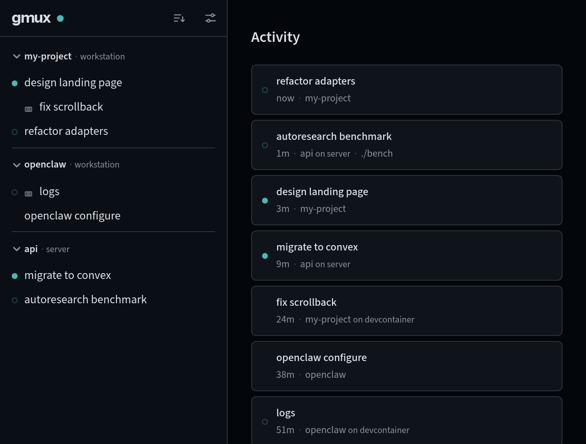

Running `gmux open` opens the dashboard in a dedicated browser window. You can also navigate to **[localhost:8790](http://localhost:8790)** directly; the first time you'll need to authenticate by visiting the login URL from `gmux auth`.

## The dashboard

The **sidebar** lists your sessions, grouped into projects. The **home screen** on the right is a feed of recent activity. Everything updates live — no refreshing.

Three controls sit in the sidebar header:

- The **gmux logo** returns you home. It lights up when a session elsewhere is waiting on you.
- The **gear** opens **Settings** (projects, hosts, notifications). A red pip on it flags a host reference that needs attention.
- The **arrange button** switches the sidebar between **Projects** (grouped, your order) and **Activity** (flat, by recency) views, narrows the tab to one host, or hides dead sessions. A dot on the button marks any non-default state.

## Your first project

A fresh sidebar is empty **by design**: gmux discovers sessions but never adds anything to the sidebar on its own. Two ways to fill it:

- **Launch from the UI.** On a fresh install the sidebar shows a single **+** button; launching from it creates a default *home* project that catches sessions started in your home directory. Once you have projects, hover a project name to reveal its **+** — it launches in that project's own directory, and the menu lists the agents installed on that host (Shell, pi, Claude Code, Codex, Editor). Double-click the **+** to launch the default instantly.
- **Add the directory you already work in.** Sessions launched from the CLI in other directories stay out of the sidebar until their project exists. Open **Settings → Projects**: gmux lists the *Discovered* directories it noticed sessions in, so adding yours is one click (or type a path).

Each project matches sessions by filesystem path (the directory and everything under it) or by git remote URL (grouping clones and worktrees). Drag to reorder, click a project name to collapse its folder. Projects on other machines aren't matched by rules — add them under **Settings → Projects → From other hosts** once the host is [connected](/multi-machine/).

## Reading a session row

Each session has a dot on the left edge:

| Indicator | Meaning |
|-----------|---------|
| **Pulsing ring** | The tool is actively working (building, thinking, running tests) |
| **Cyan dot** | New output you haven't seen yet (viewing the session clears it) |
| **Red dot** | The agent reported an error |
| **Muted ring** (brief) | Transient terminal activity, fades after a few seconds |
| **No dot** | Idle or waiting for input |

Agent sessions (pi, Claude, Codex) only trigger the unread dot when the assistant completes a turn, not on every line of output.

A row shows its working directory only when it differs from the project's folder — a subfolder or worktree appears as a relative `./sub/dir` badge, an unrelated path as its absolute `~/…` form — so sessions launched somewhere unexpected are easy to spot. Sessions on other machines carry their host name and a container icon where relevant.

## The terminal

Click a session to attach. You get a full interactive terminal powered by [xterm.js](https://xtermjs.org/) — colors, cursor positioning, mouse support, and images all work. The header shows the session title and a status chip: **Working…**/**Error** while an agent is busy, **Exited (N)** for dead sessions, **Resuming…** during a resume.

- **Find in terminal** — press **Cmd/Ctrl+F** for a floating find bar (the browser's own find can't see into a canvas-rendered terminal). Enter/Shift+Enter step through matches; Escape closes.
- **The ⋮ menu** — *Find in terminal*, one lifecycle action (**Restart** for alive sessions, **Resume**/**Rerun** for dead ones), and session info (adapter, version, host). An **outdated** badge means the session's runner predates the current daemon — restart the session to pick up the new version.
- **Dead sessions** replay their terminal history read-only, with Resume/Rerun as the primary action — agent conversations continue where they left off; other commands re-run in the same directory.
- **Dismiss** — hover a session in the sidebar and click **×**. This stops the session **and every session it launched**, then removes them from the UI. It is not data deletion: agent conversations stay in their own tools, and terminal history is kept until gmux eventually cleans it up.

Backend or action failures surface as error toasts.

## When sessions pile up

The **home screen** (`/`) is a feed of live sessions ordered by their last output, grouped into Today, Yesterday, and recent weekdays. Status changes a row's indicator, not its position — the queue stays stable while you work down it, and a session floats up only when it produces new output. Older sessions drop off home; the sidebar's **Activity** view (arrange button) keeps the complete feed, including dead-but-resumable sessions and older dates, in the sidebar's compact density.

An **Enable notifications** pill in the Activity header opts this browser into notifications for turns that finish while you're elsewhere.

## On your phone

Open the same URL on your phone — or from anywhere via [remote access](/remote-access/). The sidebar slides in from the left (tap **☰**; a badge on it flags waiting sessions), and a bottom toolbar supplies the keys phones don't have:

| Button | Sends |
|--------|-------|
| **esc** / **tab** | Escape / Tab |
| **ctrl** / **alt** | Arms the modifier for the next key: tap **ctrl**, then `c`, for Ctrl+C |
| **← ↑ ↓ →** | Arrow keys (hold to repeat) |
| **⇤ ⇥** | Word-jump left / right |
| **▶** | Send (Enter; Alt+Enter when alt is armed) |

An armed **ctrl**/**alt** highlights, applies to the next key — toolbar or on-screen keyboard — then disarms; keys never change meaning. Long-press a link in the terminal to copy it or open it in a new tab; paste goes through the paste keybind or long-press.

## Going further

- **[Keyboard shortcuts](/reference/settings/#default-keymap)** — the full default keymap, copy/paste per platform, and how to override any of it.
- **[URLs and filters](/reference/urls/)** — every session has a stable, bookmarkable URL, and a tab can be narrowed to specific projects or hosts.
- **[Multi-machine](/multi-machine/)** — connect other hosts and see their sessions here; **Settings → Hosts** shows each host's connection status.
- **[CLI reference](/reference/cli/)** — everything the UI does is also scriptable.
- **[Theme](/reference/theme/)** — terminal palette and UI theme via `theme.jsonc`.
